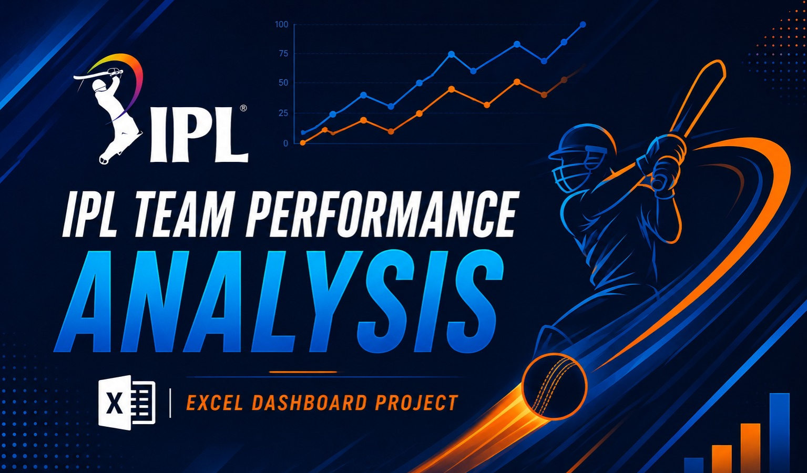
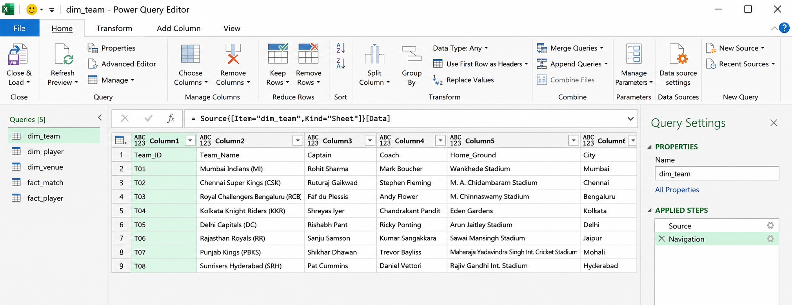
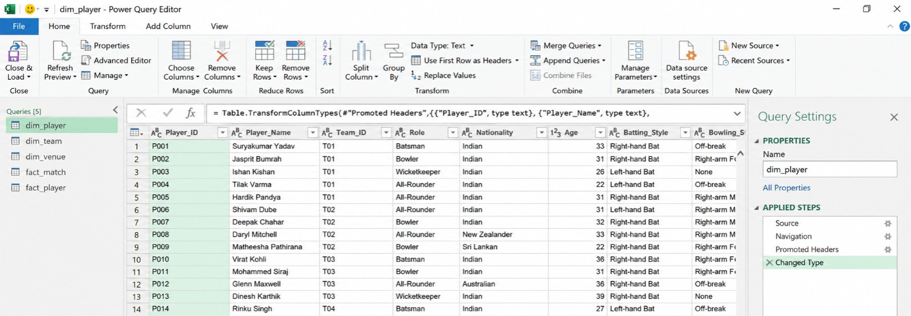
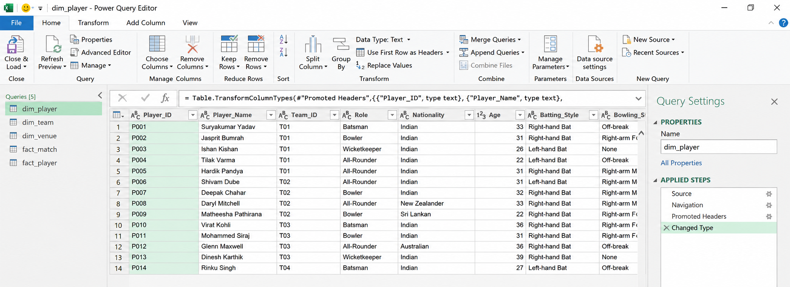
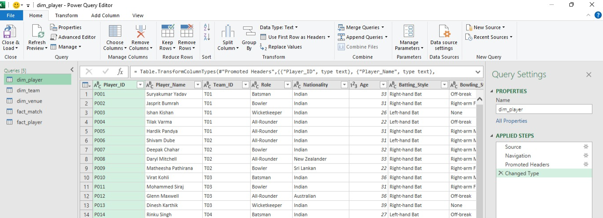

# 📊 IPL Team Performance Analysis

> **Project Status: In Progress**




--- 

## 🔹 Project Overview

This project is an interactive **Microsoft Excel dashboard** built using IPL 2025 match and player performance data.

The dashboard analyzes team performance, match results, batting, bowling, player contributions, and venue performance during the 2025 IPL season. It also includes a separate section for detailed player performance analysis to understand individual contributions to overall team performance.

---

## 🔹 Business Objectives

The main objective of this project is to analyze **IPL team performance and identify factors associated with wins and losses**.

The dashboard aims to answer questions such as:

* How did teams perform during IPL 2025?
* Which teams had the strongest overall performance?
* How did teams perform in terms of runs and wickets?
* Which teams had stronger batting or bowling performance?
* Does winning the toss appear to influence match results?
* How did teams perform across different venues and opponents?
* Which players contributed most to their team's performance?
* Which players had the strongest batting and bowling performances?

> These objectives can be expanded or refined as the analysis progresses.

---

## 🔹 Tools & Technologies

* Microsoft Excel
* Power Query Editor
* Power Pivot
* Excel Data Model
* Pivot Tables
* Pivot Charts
* Excel Formulas
* Slicers / Filters
* Dashboard Design

---

## 🔹 Dataset Overview

The project uses structured IPL 2025 data divided into **dimension and fact tables**.

### Dimension Tables

* `dim_team` — Contains team information such as team name, captain, coach, home ground, city, and owner.
* `dim_player` — Contains player information such as role, nationality, batting style, and bowling style.
* `dim_venue` — Contains venue information such as venue name, city, and capacity.

### Fact Tables

* `fact_match` — Contains match-level information such as date, teams, toss winner, match winner, scores, wickets, and overs.
* `fact_player` — Contains player-level performance such as runs, balls faced, fours, sixes, strike rate, overs bowled, runs conceded, wickets, and economy.

### Dataset Link: [ipl-2025-team-performance-dataset](https://github.com/Chauhanekta21/IPL_Team_Performance_Analysis/blob/main/Dataset/ipl_raw_data.xlsx)

---

## 🔹 Analytics Workflow

```text
Raw Data
    ↓
Data Import
    ↓
Data Inspection
    ↓
Data Cleaning
    ↓
Data Transformation
    ↓
Data Modeling
    ↓
Calculated Columns & Metrics
    ↓
Pivot Tables
    ↓
Charts & Visuals
    ↓
Interactive Dashboard
    ↓
Player-Level Drill-Down Report
```

---

## 🔹 Data Import

- Imported raw IPL 2025 CSV files into **Excel Power Query Editor**.
- Loaded 5 tables: `dim_team`, `dim_player`, `dim_venue`, `fact_match`, and `fact_player`.







---

## 🔹 Data Inspection
